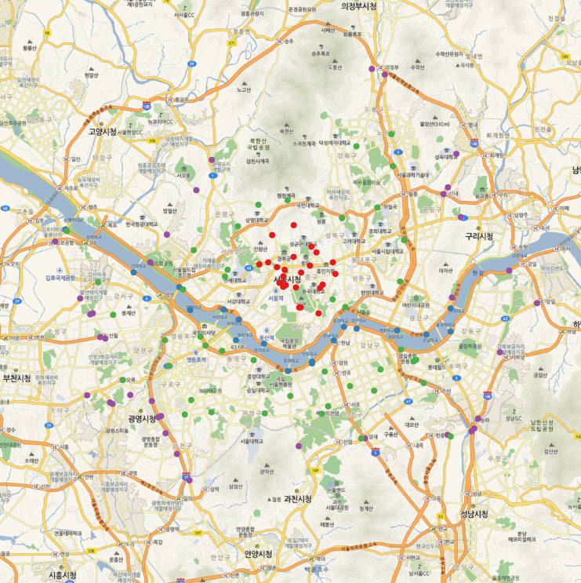

NaverMap
========
R functions for using Naver Map tiles


### An example

```coffee
require(rgdal)
require(png)
require(RgoogleMaps)
require(RColorBrewer)

# load location of traffic counting data in Seoul
library(RCurl)       
gitaddress <- "https://raw.githubusercontent.com/dongikjang/NaverMap/"
TCountingLocInSeoul <- getURL(paste(gitaddress, "master/TCountingLocInSeoul.csv", sep=""),
    	                        cainfo = system.file("CurlSSL", "cacert.pem", package = "RCurl"))
#write(TCountingLocInSeoul, file="TCountingLocInSeoul.csv")
tloc <- read.csv(textConnection(TCountingLocInSeoul), stringsAsFactors = FALSE,
                 fileEncoding = "UTF-8")
lon <- tloc$X5
lat <- tloc$X6

# download Naver Map tiles
dmap <- getNaverMap(lon, lat, zoom=NA)
cols <- brewer.pal(9, "Set1")
plot(dmap)
naverloc <- WGS842Naver(tloc[ , c("X5", "X6")])
points(naverloc,  pch=19, col=cols[tloc$X2])
```

